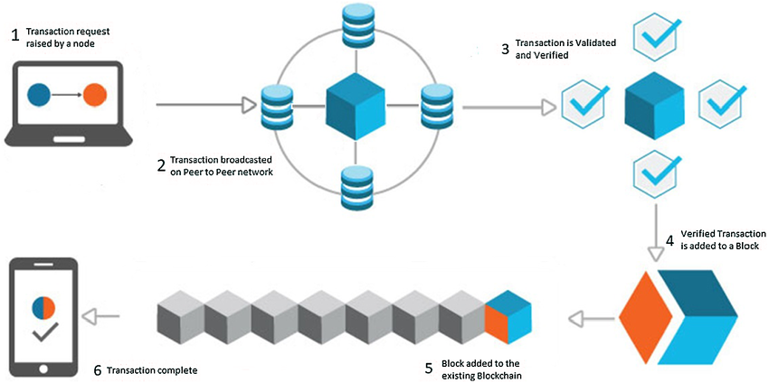

# Module 01 — From Web 1 to Web 3 & Your First Web3 Identity

## Learning Goals

By the end of this module, you will be able to:

- **Trace the evolution** of the internet from static pages to user-owned networks
- **Explain why Web3's "read-write-own" model** is a breakthrough for digital life
- **Set up a wallet** in test-net mode and understand seed-phrase safety
- **Claim a human-readable** on-chain handle (ENS/Lens/Farcaster)
- **Describe smart-account wallets** & account-abstraction (ERC-4337 / EIP-7702)

---

## Getting Started:

Welcome to your first step into Web3! This module is designed as a bridge—we'll start with the familiar (the internet you know) and gradually introduce you to the revolutionary concepts that make Web3 unique.


Let's begin by exploring how the internet has transformed over the past three decades...

## 1. The Internet's Three Ages

### 1.1 Flash-Timeline

| Era | Tagline | What changed? | Example services |
|-----|---------|---------------|------------------|
| **Web 1** (≈1990-2004) | **Read-only** | Static HTML, dial-up, no log-ins | GeoCities, Yahoo! Directory |
| **Web 2** (≈2004-2020) | **Read-write** | User-generated content, APIs, social graphs—but data stored in corporate silos | Facebook, Airbnb, PayPal |
| **Web 3** (≈2020-→) | **Read-write-own** | Blockchains for open data + token incentives + composability; users control keys & identity | Uniswap, OpenSea, Lens, Farcaster |


**Learn More**:
- [Web 1.0 Vs. Web 2.0 Vs. Web 3.0](https://www.youtube.com/watch?v=GXJp9mJR2Q8)

- [What is Web 3.0? (Explained with Animations)](https://www.youtube.com/watch?v=nHhAEkG1y2U)


---

### 1.2 What is Blockchain?

A blockchain is a special kind of database—like a shared digital notebook—that everyone can see but no one can secretly change.

Instead of trusting one company to keep data safe (like a bank or social app), blockchains use decentralized networks of computers to agree on what’s true. This makes data tamper-proof, transparent, and verifiable.



*Figure 1: Transaction flow in a Blockchain. Source: [ResearchGate](https://www.researchgate.net/figure/Transaction-flow-in-a-Blockchain_fig1_342012510) - Used under fair use for educational purposes.*


Blockchains store:

- Transactions (e.g. who sent money to whom)

- Smart contracts (code that runs on-chain)

- Ownership records (e.g. NFTs, tokens)

Popular blockchains include Ethereum, Solana, and Bitcoin—each powering a growing ecosystem of apps, assets, and communities.


**Learn More**:
- [What Is Blockchain in video](https://www.youtube.com/watch?v=yubzJw0uiE4)

- [List of 64 Blockchains](https://www.alchemy.com/dapps/top/blockchains)

---


### 1.3 Why Web 3 Matters

**🔐 Digital ownership**: Wallets sign transactions that prove you own an asset or reputation badge—no password resets.

**🧩 Composability**: Anyone can plug new apps into public smart-contract rails.

**💰 Open incentives**: Tokens let users share upside instead of being monetized as the product.

**🆔 Self-sovereign identity**: Names like `yourname.eth` or `@alice.lens` travel across every dApp.

**🌍 Real-world splash**: Brands such as Starbucks Odyssey blend loyalty points with NFTs and on-chain wallets, creating "phygital" experiences. *[Source: voguebusiness.com]*


**Learn More**:
- [Why Web3 Matters by a16z-crypto](https://a16zcrypto.com/posts/article/why-web3-matters/)


---


## 🔑 2. Making It Real: Your Web3 Toolkit

Excellent! You now understand *why* Web3 matters and can envision how user ownership could transform digital experiences. But how do you actually *participate* in this new internet?


The most fundamental tool is **Your wallet.** But as you'll discover, a Web3 wallet is much more than a place to store digital money—it's your entire digital identity, your key to the decentralized web, and your gateway to true digital ownership.


## 2. Wallets, Keys & On-Chain Identity

### 2.1 What is a Wallet?

A wallet is software or hardware that stores your private keys and builds transactions. Think of it as:

```
Private Key → Digital Signature → Blockchain Action
```


*Figure 1: Crypto Wallet Workflow. Source: [Solulab](https://www.solulab.com/cryptocurrency-wallet-rise-for-development-services/) - Used under fair use for educational purposes.*


**Learn More**:
- [Overview of Web3 Wallets](https://www.quicknode.com/guides/web3-fundamentals-security/basics-to-web3-wallets) 


**Types of Accounts:**
- **EOA (Externally Owned Account)**: Classic MetaMask address, controlled by a single key
- **Smart Account (Contract Wallet)**: Programmable logic, multi-sig, session keys—enabled by account abstraction *[Sources: docs.safe.global, blog.thirdweb.com]*


Learn More Here:
- [Overview of Smart Account](https://portal.thirdweb.com/connect/account-abstraction/how-it-works)

---

**📱 Choosing Your First Wallet**

For beginners, we recommend starting with a **browser extension wallet** like MetaMask because it offers the best balance of usability and dApp compatibility. As you become more comfortable, you can always explore other options.


### 2.2 Types of Wallets

| Category | Examples | Pros | Trade-offs |
|----------|----------|------|------------|
| **Browser extension** | MetaMask, Rabby | Fast onboarding, rich dApp support | Phishing risk, key in hot storage |
| **Mobile** | Rainbow, Trust, Coinbase Wallet | Touch-ID UX, NFC signing | Same hot-wallet risks |
| **Smart-contract** | Safe, Argent | Social recovery, batched tx, gas sponsorship | Slightly higher network fees; not on every chain yet |
| **Hardware** | Ledger, Keystone | Keys offline | Cost, extra steps |

---

**🎯 Time to Get Your Hands Dirty**

### 2.3 Hands-on  — Set Up a Wallet (Testnet / Mainnet)

- You can create your first Wallet through learning from below: 

  - [Get Start with MetaMask](https://support.metamask.io/start/getting-started-with-metamask/)
  - [Set Up and Use MetaMask’s Crypto Wallet](https://nftnow.com/guides/how-to-set-up-metamask-wallet/)


---

**🏷️ Making Your Address Human-Friendly**


### 2.5 Claiming Your Web3 Handle

| System | What you get | How to try (free or low-cost) |
|--------|--------------|-------------------------------|
| **ENS (.eth name)** | Universal domain → resolves to any address | On testnet: go to the [ENS App](https://app.ens.domains), switch to Sepolia, register a sub-name under example.eth *[docs.ens.domains]* |
| [Farcaster](https://farcaster.xyz/) | Decentralized social username (@you) plus custody address |  Install Warpcast, create an account, then verify an ETH address under Settings → Identity *[forbes.com]* |

#### 🛠️ Mini-project: Complete Web3 Identity Setup

1. **Register a free test ENS sub-domain**
2. **Set a custom avatar** (NFT or off-chain image)
3. **Post your new name** in a Farcaster frame or Lens post

---

## 3. Further Learning 📚

| Topic | Resource |
|-------|----------|
| **Intro video — "Web 3 in 10 mins"** | [Finematics YouTube](https://youtube.com/finematics) |
| **Smart-wallet SDK** | [thirdweb Account Abstraction docs](https://blog.thirdweb.com) |
| **ENS Quick-start** | [docs.ens.domains → Quickstart](https://docs.ens.domains) |
| **Lens tutorial** | [YouTube guide by devrel_eth](https://youtube.com) |
| **Farcaster ecosystem** | [forbes.com feature article](https://forbes.com) |
| **Safe Smart Accounts** | [docs.safe.global overview](https://docs.safe.global) |

---

## 📚 Your Web3 Dictionary

This glossary covers the essential vocabulary from this module, but don't feel pressured to memorize everything immediately.

**How to use this:** Treat this as a reference tool. When you see a term in other Web3 content and can't quite remember what it means, come back here for a quick refresh. Over time, these concepts will become second nature.

**Living vocabulary:** Web3 terminology is still evolving. New terms emerge regularly, and existing ones sometimes change meaning. What matters most is understanding the core concepts behind the words.

## 4. Glossary 🗂️

| Term | Plain-English meaning |
|------|----------------------|
| **Block** | A batch of verified transactions added to a blockchain |
| **dApp** | Decentralized application running on a blockchain |
| **EOA** | Externally Owned Account (normal wallet address) |
| **Gas** | Small ETH fee paid to miners/validators for executing a tx |
| **NFT** | Non-Fungible Token—unique digital item or credential |
| **Seed Phrase** | 12- or 24-word master key that can regenerate your wallet |
| **Smart Account** | Wallet implemented as a smart contract (multi-sig, social recovery) |
| **Account Abstraction** | Turning every wallet into programmable code (ERC-4337, native, EIP-7702) |
| **ENS** | Ethereum Name Service—yourname.eth domains |
| **Lens** | Composable, on-chain social graph protocol |
| **Faucet** | Web service that drips free testnet coins |

---

## 🌟 Ready for the Next Adventure?

Excellent! You've mastered the foundations of Web3—you understand the big picture, you have the tools (wallet + identity), and you know how to navigate safely. But having a wallet is just the beginning. 

**What can you actually *do* with Web3?** That's where things get really exciting. In the next module, we'll explore how Web3 enables new forms of finance, trading, and value creation that simply weren't possible in the Web2 world.

## 🚀 Up Next

**Module 02** dives into **DeFi & On-Chain Value Transfer**, where you'll swap tokens on a DEX and trace how liquidity pools work.


**Happy building & exploring! 🎉**